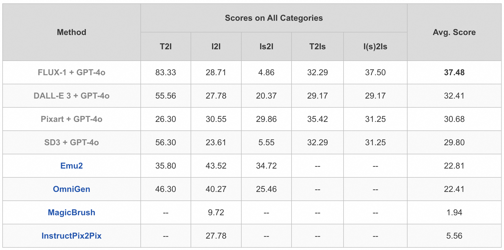

# IDEA-Bench: How Far are Generative Models from Professional Designing?

<p align="center">
    
</p>

<font size=3><div align='center' > [[🍎 Project Page](https://ali-vilab.github.io/IDEA-Bench-Page/)] [[📖 arXiv Paper](https://arxiv.org/abs/2412.11767)] [[🤗 Dataset](https://huggingface.co/datasets/ali-vilab/IDEA-Bench)] [[⚔️ Arena](https://huggingface.co/spaces/ali-vilab/IDEA-Bench-Arena)]  </div></font>

---

## 🔥 News

* **`2025.1.8`**  The official [Arena](https://huggingface.co/spaces/ali-vilab/IDEA-Bench-Arena) is now open. You’re welcome to submit your model results!
* **`2024.12.18`** The code for automated evaluation is available! Please refer to [MLLM Evaluation](#mllm-evaluation).
* **`2024.12.17`** Paper is available on Arxiv. Dataset is available on Hugging Face. 

## 👀 Contents

- [IDEA-Bench Overview](#idea-bench-overview)
- [Dataset License](#dataset-license)
- [MLLM Evaluation](#mllm-evaluation)
- [Arena Leaderboard](#leaderboard)
- [Citation](#citation)


## IDEA-Bench Overview

**IDEA-Bench** (***I**ntelligent **D**esign **E**valuation and **A**ssessment **B**enchmark*) is a comprehensive and pioneering benchmark designed to advance the capabilities of image generation models toward professional-grade applications. It addresses the gap between current generative models and the demanding requirements of professional image design through robust evaluation across diverse tasks.

### Task Coverage
IDEA-Bench encompasses **100 professional image generation tasks** and **275 specific cases**, systematically categorized into five major types:
1. **Text to Image (T2I):** Generate single images from text prompts.
2. **Image to Image (I2I):** Transform or edit input images based on textual guidance.
3. **Multi-image to Image (Is2I):** Create a single output image from multiple input images.
4. **Text to Multi-image (T2Is):** Generate multiple images from a single text prompt.
5. **(Multi-)image to Multi-image (I(s)2Is):** Create multiple output images from one or more input images.

<p align="center">
    
</p>

### Evaluation Framework
- **Binary Scoring Items:** Incorporates **1,650 binary scoring items** to ensure precise, objective evaluations of generated images.
- **MLLM-Assisted Assessment:** Includes a **representative subset of 18 tasks** with enhanced criteria for automated assessments, where MLLM are leveraged to transform evaluations into image understanding tasks, surpassing traditional metrics like FID and CLIPScore in capturing aesthetic quality and contextual relevance.

<p align="center">
    
</p>


## Dataset License

**License**:
The images and datasets included in this repository are subject to the terms outlined in the [LICENSE](LICENSE) file. Please refer to the file for details on usage restrictions.


## MLLM Evaluation

<p align="center">
    
</p>


### 1. Environment Setup

Set up the environment for running the evaluation scripts.

```bash
conda create -n ideabench python=3.10
conda activate ideabench
cd IDEA-Bench
pip install -r requirements.txt
```

### 2. Download the Dataset

Download the [dataset](https://huggingface.co/datasets/ali-vilab/IDEA-Bench) and place it in the `dataset/` folder under the root of your project.

### 3. Run the Model to Generate Results

Run your model to generate the results for all tasks. Save the output in the `outputs/` folder, which should mirror the structure of the dataset.

Your directory structure should look like this:

```
IDEA-Bench/
├── assets/
├── dataset/
│    └── IDEA-Bench/
│       ├── 3d_effect_generation_single_reference_0001/
│       ├── 3d_effect_generation_single_reference_0002/
│       ├── 3d_effect_generation_three-view_reference_0001/
│       └── ...
├── eval_results/
├── outputs/
│    └── model_results/
│       ├── 3d_effect_generation_single_reference_0001/
│       │   └── 0001.jpg   
│       ├── 3d_effect_generation_single_reference_0002/
│       │   └── 0001.jpg   
│       ├── 3d_effect_generation_three-view_reference_0001/
│       └── ...
├── scripts/
├── requirements.txt
└── ...
```

Each case folder in the `outputs/` folder should have images named `0001.jpg`, `0002.jpg`, etc., corresponding to the model's output for each task.

### 4. Stitch Images for MLLM Evaluation

Use the script `scripts/stitch_image.py` to stitch the generated images. 

```bash
python scripts/stitch_image.py {path_to_dataset} {path_to_generation_result}
```

This will create a new folder under the model’s output directory with the suffix `_stitched`, which will contain stitched images ready for evaluation and a `summary.csv` file containing paths to the images and relevant evaluation questions.

### 5. Run MLLM Evaluation Using Gemini API

**important**: Before running the script, make sure to configure your API key for the Gemini API. At the beginning of the `scripts/gemini_eval.py` file, you will find the following line:

```python
genai.configure(api_key="YOUR_API_KEY")
```

Replace "YOUR_API_KEY" with your actual Gemini API key.

Use the script `scripts/gemini_eval.py` to run the evaluation using Gemini 1.5 pro. The first argument should be the path to the `summary.csv` generated in the previous step. You can also use the optional argument `--resume` to continue the evaluation from the last checkpoint.

```bash
python scripts/gemini_eval.py {path_to_summary}
```

The evaluation results will be saved in the `eval_results/` folder as a CSV file.

### 6. Calculate Final Scores

Use the script `scripts/cal_scores.py` to calculate the final evaluation scores. The input for this step will be the CSV file generated from the Gemini evaluation.

```bash
python scripts/cal_scores.py {path_to_evaluation_result}
```

## Leaderboard 

Learderboard based on **Arena** is coming soon. 


## Citation

If you find our work helpful for your research, please consider citing our work.   

```bibtex
@misc{liang2024ideabenchfargenerativemodels,
      title={IDEA-Bench: How Far are Generative Models from Professional Designing?}, 
      author={Chen Liang and Lianghua Huang and Jingwu Fang and Huanzhang Dou and Wei Wang and Zhi-Fan Wu and Yupeng Shi and Junge Zhang and Xin Zhao and Yu Liu},
      year={2024},
      eprint={2412.11767},
      archivePrefix={arXiv},
      primaryClass={cs.CV},
      url={https://arxiv.org/abs/2412.11767}, 
}
```
